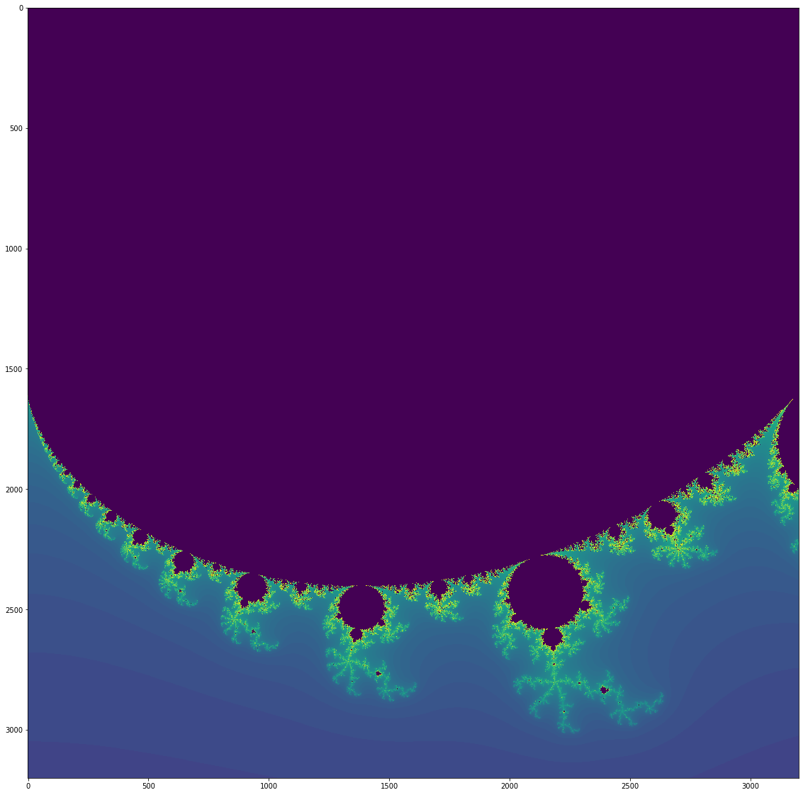

# The World's Simplest Implementation of the Mandelbrot Set

This is intended as a starter for students to do further development.

Ideas:

1. Add ability to zoom in
1. Add ability to specify a center point
1. Make threshold a variable
1. Make limit (max number of iterations) a variable
1. Rescale values for plotting (perhaps use a log scale)
1. Experiment with different color maps
1. Explore the path a particular point follows as it converges or diverges

